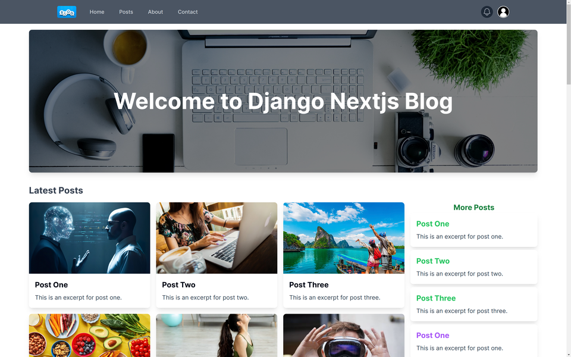

---


# Next.js Blog App

<!--  -->

A modern and fully-featured blog application built using [Next.js](https://nextjs.org/).



## Getting Started

### Prerequisites

- Node.js (version 14.x or later)
- npm, pnpm or yarn
- Python (version 3.8.x or later)

### Installation

1. **Clone the repository:**

   ```bash
   git clone https://github.com/kmjaman/nextjs-blog.git
   cd nextjs-blog/frontend/
   ```

2. **Install dependencies:**

   Using npm:
   ```bash
   npm install
   ```

    Using pnpm:
   ```bash
   pnpm install
   ```

   Using yarn:
   ```bash
   yarn install
   ```

3. **Run the development server:**

   ```bash
   npm run dev
   pnpm dev
   yarn dev
   ```

4. **Create and activate a virtual environment:**

   ```bash
   cd nextjs-blog/backend/

   python3 -m venv venv
   source venv/bin/activate

   # On Windows use
   venv\Scripts\activate
   ```

5. **Install the required packages:**

   ```bash
   pip install -r requirements.txt
   ```

6. **Set up the database:**

   ```bash
   python manage.py makemigrations
   python manage.py migrate
   ```

7. **Run Django backend server:**

   ```bash
   python manage.py runserver
    ```

Open [http://localhost:3000](http://localhost:3000) with your browser to see the Nextjs blog App.

### Building for Production

To create an optimized production build, run:

```bash
npm run build
npm start
```

This command generates a `.next` folder with all the necessary static files to deploy.

## Contributing

Contributions, issues, and feature requests are welcome! Feel free to check the [issues page](https://github.com/kmjaman/nextjs-blog/issues).

1. Fork the project.
2. Create your feature branch (`git checkout -b feature/new-feature`).
3. Commit your changes (`git commit -m 'Add some feature'`).
4. Push to the branch (`git push origin feature/new-feature`).
5. Open a pull request.

## License

This project is licensed under the GNU GENERAL PUBLIC LICENSE - see the [LICENSE](LICENSE) file for details.

## Acknowledgements

- [Next.js](https://nextjs.org/)
- [React](https://reactjs.org/)
- [Tailwind CSS](https://tailwindcss.com/)
- [Python](https://python.org/)

---

### Contact

- **Kamrujjaman Md** - [kmjaman@outlook.com](mailto:kmjaman@outlook.com)
- **GitHub**: [https://github.com/kmjaman](https://github.com/kmjaman)
- **LinkedIn**: [@kamrujjaman](https://www.linkedin.com/in/kamrujjaman-md-6589a244/)

---
